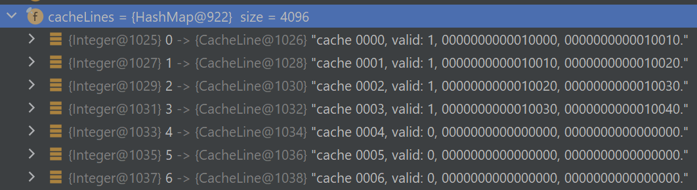
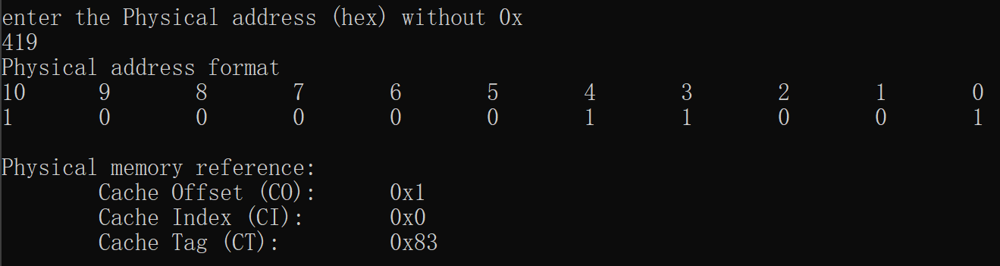

# CSAPP-cache-visualization

Several tools to help understanding and visualizing the cache concepts covered in CSAPP and ANU COMP2310 course.

## Tools

### DirectMappedCacheSimulator

A java program to illustrate the read and write on direct mapped cache. With java debugger, it is easy to discover what is happening in the cache.

#### Example

Question from ANU-COMP2310:

> Given direct mapped cache of size 64K with block size of 16 bytes, and the code

```c
void copy_matrix(int dest[ROWS][COLS], int src[ROWS][COLS]) {
  int i, j;
  for (i = 0; i < ROWS; i++) {
    for (j = 0; j < COLS; j++) {
      dest[i][j] = src[i][j];
    }
  }
}
```

> What is the cache miss rate if ROWS = 128 and COLS = 192?  

Following code in `Main.java` can illustrate the access pattern and 

```java
    public static void main(String[] args) {
        int ROWS = 192;
        int COLS = 128;
        long src = 0L; // start addr of src
        long dest = src + ROWS * COLS * 4; // start addr of dest
        DirectMappedCache cache = new DirectMappedCache(64 * 1024, 16); // initialize the cache
        // rewrite the routine in term of read and write
        for (int j = 0; j < COLS; j++) {
            for (int i = 0; i < ROWS; i++) {
                cache.read(src + i * COLS * 4 + j * 4);
                cache.write(dest + i * COLS * 4 + (COLS - 1 - j) * 4);
            }
        }
        // printout the finial hit / miss
        cache.outputSummary();
    }
```

When we step over in debugger, we can see how cache line's content change 



Each cache line in the form`cache cache index, valid, start addr, end addr`.

After all, `cache.outputSummary();` will give the summary

```
Hit ratio: 	0.25
Miss ratio:	0.75
Hit: 	12288
  Read Hit: 	6144
  Write Hit: 	6144
Miss: 	36864
  Read Miss: 	18432
  Write Miss: 	18432
```

### Cache lookups.c

The question might give an table of cache,

| Set index | Tag  | Valid | Byte 0 | Byte 1 | Byte 2 | Byte 3 |
| --------- | ---- | ----- | ------ | ------ | ------ | ------ |
| 0         | 0    | 1     | 21     | 12     | 90     | 82     |
|           | 83   | 1     | A2     | 89     | 12     | D3     |
| 1         | 0    | 1     | 12     | 32     | 31     | 27     |
|           | 83   | 0     | —      | —      | —      | —      |

and corresponding physical address wide. Suppose the address wide is 11 in our question.

The complied `cache lookups.c` can illustrate format of such cache:


Also, given an physical address like `0x419`, it can figure out the corresponding information:



According to these information, we can find the value `89` in the cache table.